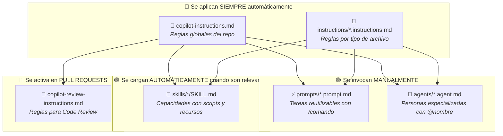
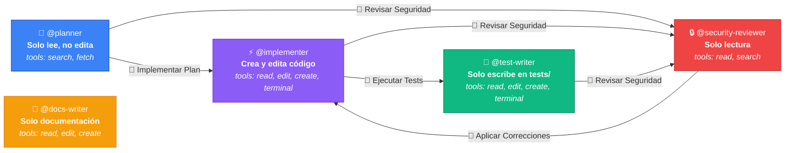
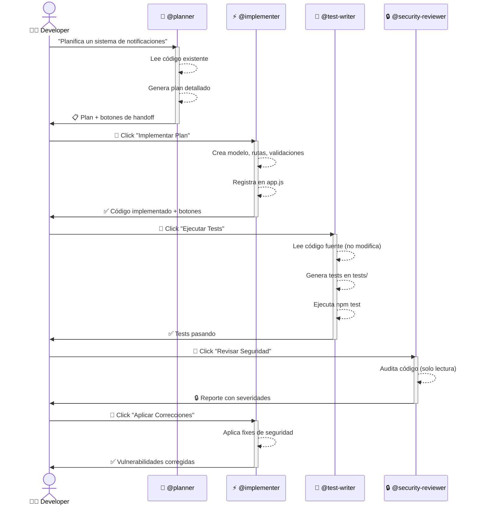
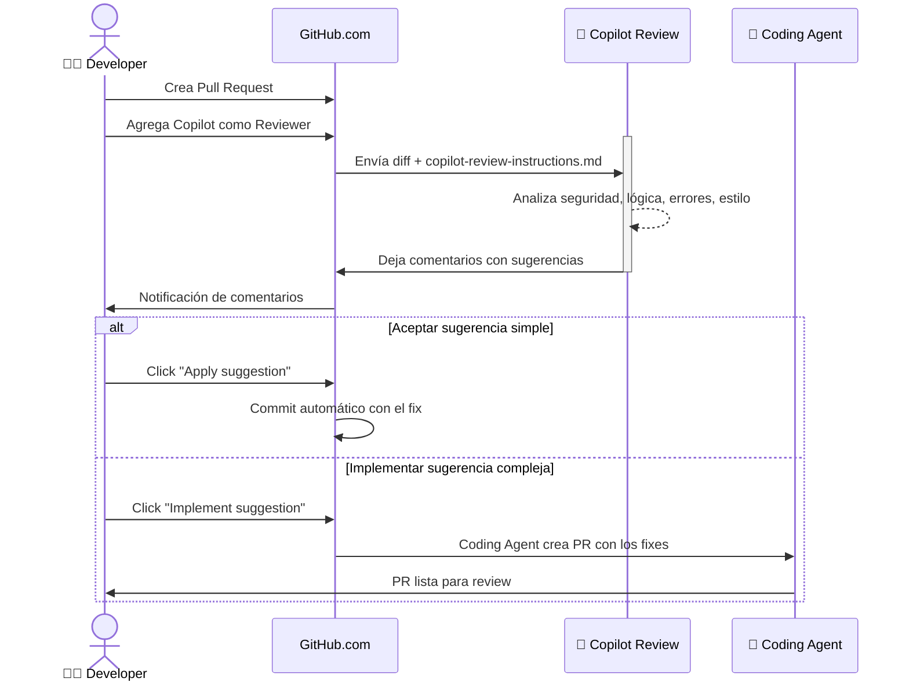
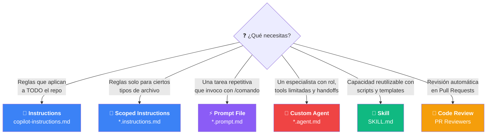
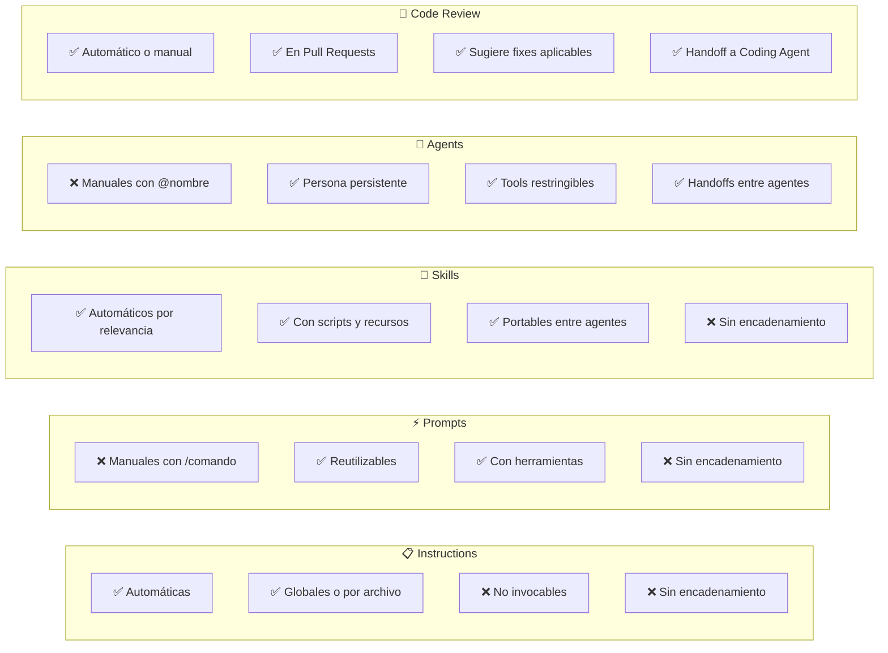

# 🤖 GitHub Copilot Demo: Skills, Prompts, Agents & Code Review

Este repositorio es una **demo práctica** para mostrar las capacidades de personalización de GitHub Copilot en un solo repo.

## 🎯 ¿Qué vamos a demostrar?

| Feature | Ubicación | Descripción |
|---------|-----------|-------------|
| **Custom Instructions** | `.github/copilot-instructions.md` | Reglas globales para todo el repo |
| **Scoped Instructions** | `.github/instructions/*.instructions.md` | Reglas por tipo de archivo |
| **Prompt Files** | `.github/prompts/*.prompt.md` | Comandos reutilizables (`/comando`) |
| **Agent Skills** | `.github/skills/*/SKILL.md` | Capacidades especializadas con scripts |
| **Custom Agents** | `.github/agents/*.agent.md` | Agentes especializados con handoffs |
| **Code Review** | PR → Reviewers → Copilot | Review automático en Pull Requests |

---

## 🧩 ¿Cómo se relacionan entre sí?

Copilot tiene un sistema de personalización por capas. Cada pieza tiene un propósito distinto y se complementan:



> **Las instrucciones globales y scoped son la base.** Se inyectan automáticamente en cualquier interacción con Copilot, ya sea al usar un prompt, un agente, un skill, o un code review.

---

## 🔄 Flujo de Custom Agents con Handoffs

Los agentes funcionan como un **equipo de especialistas** que se pasan el trabajo entre sí. Cada uno tiene un rol, herramientas restringidas, y botones de handoff que aparecen al final de su respuesta:



### Flujo principal de la demo



---

## 🔍 Flujo del Code Review en PRs



---

## ❓ ¿Cuándo usar cada uno?



---

## 📊 Comparativa Rápida



---

## 📁 Estructura del Proyecto

```
copilot-demo-repo/
├── .github/
│   ├── copilot-instructions.md          # ① Instrucciones globales
│   ├── copilot-review-instructions.md   # ② Instrucciones para Code Review en PRs
│   ├── instructions/
│   │   ├── nodejs.instructions.md       # ③ Instrucciones para archivos .js
│   │   └── tests.instructions.md        # ④ Instrucciones para archivos de test
│   ├── prompts/
│   │   ├── create-endpoint.prompt.md    # ⑤ Prompt: crear endpoint REST
│   │   ├── code-review.prompt.md        # ⑥ Prompt: revisar código
│   │   └── generate-tests.prompt.md     # ⑦ Prompt: generar tests
│   ├── agents/
│   │   ├── planner.agent.md             # ⑧ Agente: planificador de features
│   │   ├── implementer.agent.md         # ⑨ Agente: implementador de código
│   │   ├── security-reviewer.agent.md   # ⑩ Agente: auditor de seguridad
│   │   ├── test-writer.agent.md         # ⑪ Agente: escritor de tests
│   │   └── docs-writer.agent.md         # ⑫ Agente: documentación
│   └── skills/
│       ├── api-endpoint/
│       │   └── SKILL.md                 # ⑬ Skill: crear endpoints REST
│       └── unit-testing/
│           └── SKILL.md                 # ⑭ Skill: framework de testing
├── src/
│   ├── app.js                           # Express app principal
│   ├── routes/
│   │   └── users.js                     # Rutas de ejemplo (con bugs para demo)
│   ├── models/
│   │   └── user.js                      # Modelo de usuario
│   ├── middleware/
│   │   └── auth.js                      # Middleware de autenticación
│   └── utils/
│       └── validator.js                 # Utilidades de validación
├── tests/
│   └── users.test.js                    # Tests de ejemplo
├── package.json
└── README.md
```

---

## 🚀 Guía de la Demo

### Demo 1: Custom Instructions (5 min)

1. Abre el repo en VS Code con Copilot activado
2. Copilot carga automáticamente `.github/copilot-instructions.md`
3. Pide en chat: *"Crea una función para conectar a la base de datos"*
4. Observa cómo Copilot sigue las convenciones del proyecto (async/await, JSDoc, manejo de errores)

### Demo 2: Scoped Instructions (5 min)

1. Abre `src/routes/users.js` → se aplican las instrucciones de `nodejs.instructions.md`
2. Abre `tests/users.test.js` → se aplican las instrucciones de `tests.instructions.md`
3. Muestra cómo las sugerencias cambian según el tipo de archivo

### Demo 3: Prompt Files (10 min)

1. En Copilot Chat escribe `/create-endpoint` → genera un endpoint REST completo
2. Escribe `/code-review` → analiza el archivo actual
3. Escribe `/generate-tests` → genera tests para el archivo actual

### Demo 4: Agent Skills (10 min)

1. En Agent Mode, pide: *"Crea un nuevo endpoint CRUD para productos"*
2. Copilot detecta automáticamente el skill `api-endpoint` y lo sigue
3. Pide: *"Genera tests para el módulo de usuarios"*
4. Copilot detecta el skill `unit-testing`

### Demo 5: Custom Agents con Handoffs (15 min)

Los agentes son "compañeros especializados" que puedes invocar por nombre y encadenar en flujos de trabajo.

1. En VS Code, abre el dropdown de agentes en Copilot Chat
2. Selecciona **@planner** y escribe:

   > "Planifica un módulo CRUD para gestionar pedidos (orders) con userId, productos, total, estado y dirección de envío"

3. El planner genera un plan detallado SIN tocar código
4. Al terminar, aparece el botón **"Implementar Plan"** → hace handoff a **@implementer**
5. El implementer crea los archivos siguiendo el plan
6. Al terminar, aparece **"Ejecutar Tests"** → hace handoff a **@test-writer**
7. El test-writer genera tests completos en `tests/`

**Demo del agente de seguridad (standalone):**
1. Selecciona **@security-reviewer** y escribe:

   > "Analiza src/routes/users.js"

2. Genera un reporte con los 8 bugs intencionales clasificados por severidad

**Demo del agente de documentación:**
1. Selecciona **@docs-writer** y escribe:

   > "Genera la documentación API para todos los endpoints de usuarios"

2. Crea `docs/api.md` con documentación completa

### Demo 6: Code Review en PRs (10 min)

1. Crea una rama: `git checkout -b feature/add-products`
2. Agrega código con errores intencionales (ya incluido en el repo)
3. Haz push y crea un Pull Request
4. En GitHub.com → PR → Reviewers → selecciona **Copilot**
5. Copilot deja comentarios con sugerencias de mejora
6. Opcionalmente: usa "Implement suggestion" para que el Coding Agent aplique los fixes

---

## ⚙️ Configurar Code Review Automático

### Opción A: Manual por PR
En cada PR → Reviewers → Copilot

### Opción B: Automático con Rulesets
1. Repo → Settings → Rules → Rulesets
2. New ruleset → Branch ruleset
3. Habilitar "Automatically request Copilot code review"
4. Opcionalmente: "Review new pushes" y "Review draft PRs"

### Opción C: Desde CLI
```bash
# Crear PR con Copilot como reviewer
gh pr create --reviewer @copilot

# Agregar Copilot a PR existente
gh pr edit --add-reviewer @copilot
```

---

## 📋 Requisitos

- GitHub Copilot Pro, Pro+, Business o Enterprise
- VS Code con extensión de GitHub Copilot
- Node.js 18+
- GitHub CLI (`gh`) para la demo de Code Review desde terminal

## 🏁 Setup

```bash
git clone https://github.com/TU-USUARIO/copilot-demo-repo.git
cd copilot-demo-repo
npm install
npm run dev
```
